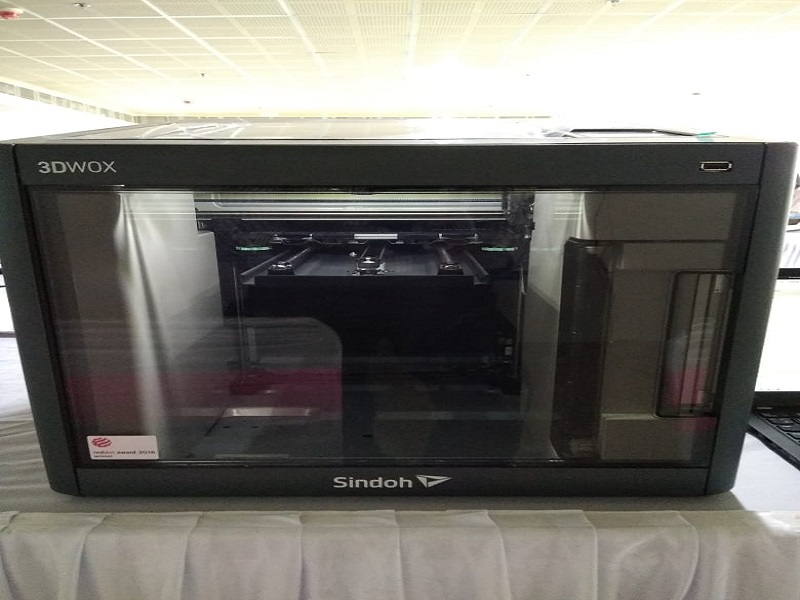

# Sindoh 3D WOX Printer
  

3D printer which we have is a 0.4 mm dia. So Scale the object as per the requirement. If we scale below 0.4 mm dia the object don't print exactly.  Object printing time is depend on size of the object going to print, if size is big it will print hours together.  
## Instructions as fallows  

     1. Open the 3D_WOX printer software and load the object which was designed in a software OR downloaded from the net.  
     2. Give the Print, it will calculate the printing duration and will display.   
     3. Printer will display the object what is going to print on the screen.  
     4. Printer nozzle will be heated up to 200 degree C. Then printing will start.  
     5. After completion of print, properly we have to remove the bed and place it on a table for 2 min. to reduce the heat.  
     6. With the help of hand knife remove the object from the bed.
[Download the User Manual](files/sindho.pdf)  
 ### Information about 3D Wox printer
What is 3D WOX ? 3D WOX is a high quality 3D printer based on user friendly functions. Easy to use TOUCH UI, integrated with an internal camera, automatic filament installation etc. easy to use even for first time users. Wide variety of PLA and ABS colors. Build your dreams into reality.

What files can I print with my 3D Printer? Ply. Obj, stl format files are supported. Currently on the basis of Stl files, files under 200mb can be printed.

What is a filament? Material for FFF system 3D printer. The main properties of filament is plastic, however there are filaments where metal and even wood is infused.

How to load/unload the filament? Turn on the printer, press the cartridge button on the UI, pressing the Load button will initiate the loading process. In the loaded status, press the cartridge button in UI, the Unload button will initiate the unload process.

 
### how to print 3D object: 
#### Software used in designing:
- 3d Wox Software
- Ultimate Cura
- Free Cad

the  above said software are used to design a 3d object and print the object.

what is the 3D printing?

3D printing is a process where a three-dimensional object is made by joining material in a computer controlled way. There are several techniques to join the material; melting plastic and laying it on top of each other (FDM or fused deposition modeling), fusing powder together or fusing liquid molecules together. 
The 3DWOX printer makes objects by stacking different layers of molten plastic on top of each other.

if create 3d Object we have follow three steps while using 3D wox software.
- first of all import 3D file in 3D wox software 
- change settings(like scale,model and     thikness ...ect)
- Send file to print (Connect with network).