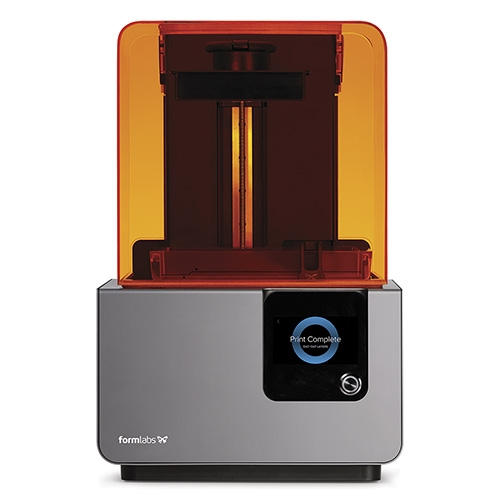

# Formlabs 3D printer 

The Form 2 is engineered for reliability and production of prints from tiny, intricately detailed models, to large, sturdy prototypes at an affordable price.

The Form 2 is the most advanced professional stereolithography (SLA) desktop 3D printer on the market. It is the successor to the award-winning Form 1+, and it is way more than just an incremental update. In fact, the Form 2 is in a whole new league.  

 Specification
- Technology: Stereolithography (SLA)
- Build Volume : 145 × 145 × 175 mm (5.7 × 5.7 × 6.9 in)
- Layer Thickness : (Axis Resolution) 25, 50, 100 microns (0.001, 0.002, 0.004 inches)
- Material : Photopolymer Resin
- Resin Types : Standard Resins - general purpose. Functional Resins - Castable, Dental SG (Biocompatible Class 1), Flexible & Tough
- Software : PreForm 
- Connectivity : Wifi, Ethernet and USB
- File type: .stl, obj