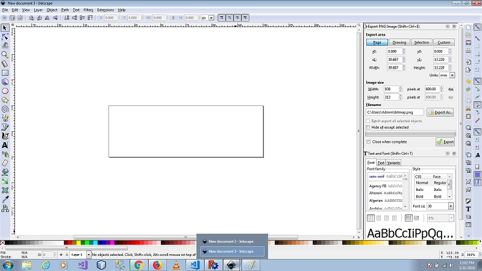

# Inkscape 2D Design 
Inkscape is professional quality 2D graphics software. It used for creating graphics such as icons, logos, diagrams, maps and web graphics...etc.

[Download inkscape for windows](https://inkscape.org/release/inkscape-0.92.4/windows/64-bit/exe/dl/)

1. open inkscape 2D design software and create as fallows
     * Select new from template and select generic and set custom width and height.  
     for example i create my name as image so i prefer for width 150px and height 50px    
      
     
     *  Then we have to write a name what you print and set it in center and save export to the file to png format  
