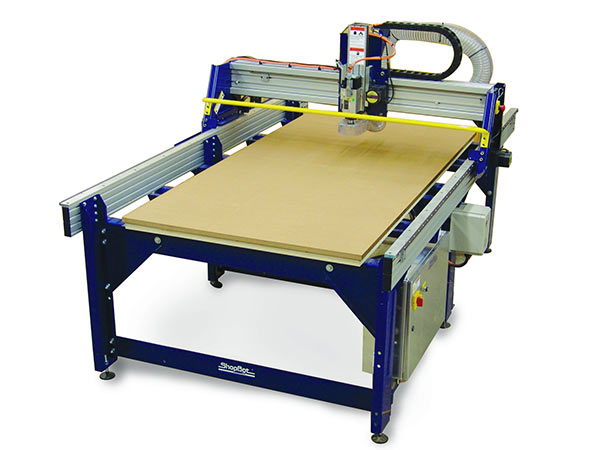

# ShopBot 3D Cutting and CNC Routers:
 ShopBot Using advanced technology for CNC cutting, drilling, carving and machining, the PRSalpha series tools deliver rapid transit speeds of 1800 inches per minute and cutting speeds of up to 600 inches per minute.

 ShopBot builds CNC gantry tools in many sizes to suit the varying needs of manufacturers: 96 x 48, 96 x 60, 120 x 60, 144 x 60.

 