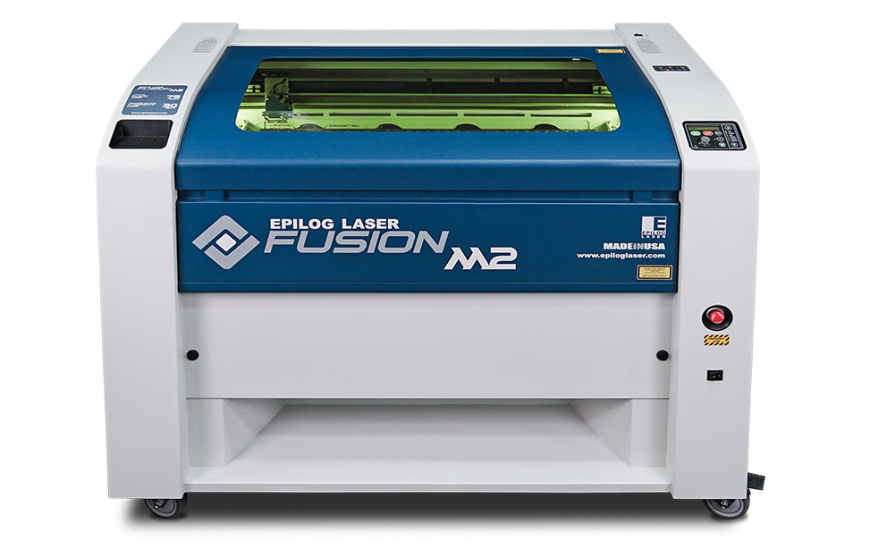

# Epilog Laser Fusion M2   

  
  
  the Fusion M2 32 is The high quality engraving across the entire table is a result of the highest-quality components, high-speed servo motors, and the exciting optional Dual Source and Camera Registration options.  

[ Epilog Laser Fusion M2 User Manual](https://www.epiloglaser.com/assets/downloads/manuals/fusion-manual-web.pdf)  
[Demo Videos Clickhere](https://www.youtube.com/watch?v=1bS3adFjneI)  
[For More Details Clickhere](https://www.epiloglaser.com/company/pr/fusion-m2.htm)