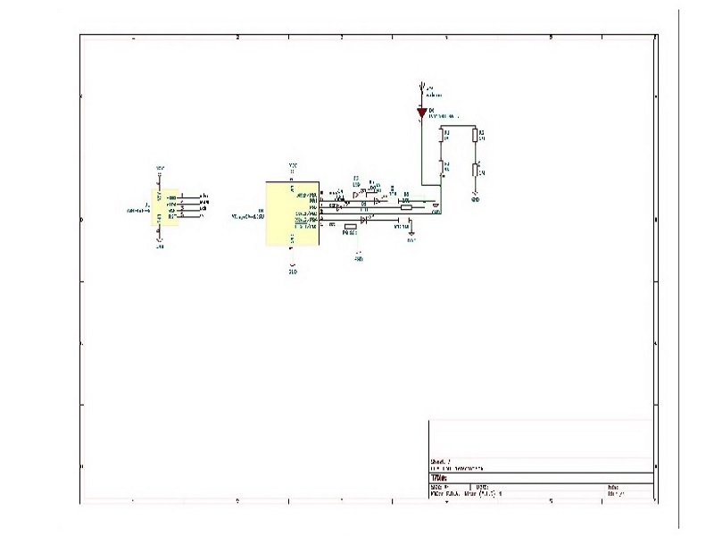

## Final project: 
### EMF Detector:
### About EMF :
EMF detector is a test and measurement apparatus that is used in different industrial applications for detecting problems in electrical wiring and power lines. The EMF meter gives information about the workflow in the electromagnetic field by the measuring electromagnetic radiation flux density (DC). Moreover, this instrument can track the changes in the electromagnetic field that occur over a confident period of the time (AC fields).

### Working Principal of the project:

   The EMF meters detect issues in the electromagnetic field by the measurable changes in the quantity of electric or magnetic energy that flows in the field that is being precise. This is complete with the highly-sensitive components which are part of the arrangement of this test and measurement device. According to the fluctuations in the quantity of electric or magnetic energy (if there are any), the EMF meter can specify existent issues in the work of the electrical wiring and power lines. These method bigger problems can be prevented and proper work flow in the manufacturing sites is ensured.

### Circuit Design:

  

### Add Foot Print:

 

