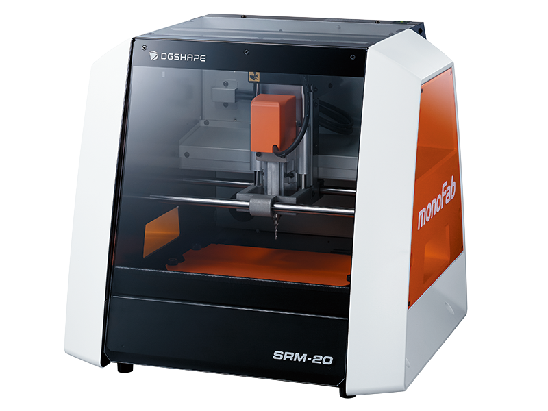

# Milling Machine
Milling Machine is used to printed circuit board milling (also: isolation milling) is the process of removing areas of copper from a sheet of printed circuit board material to recreate the pads, signal traces and structures according to patterns from a digital circuit board plan known as a layout file.  
 1. Similar to the more common and well known chemical PCB etch process, the PCB milling process is Subtractive material is removed to create the electrical isolation and ground planes required. However, unlike the chemical etch process, PCB milling is typically a non-chemical process and as such it can be completed in a typical office or lab environment without exposure to hazardous chemicals. High quality circuit boards can be produced using either process.  
 2. In the case of PCB milling, the quality of a circuit board is chiefly determined by the system's true, or weighted, milling accuracy and control as well as the condition (sharpness, temper) of the milling bits and their respective feed/rotational speeds. By contrast, in the chemical etch process, the quality of a circuit board depends on the accuracy and/or quality of the photo masking and the state of the etching chemicals.

 

### About SRM-20 portable milling machine 
    The SRM-20 portable milling machine can mill a broad range of materials,  
    including modeling wax, chemical wood, foam, acrylic, poly acetate, ABS and  
    PC board.Milling Made Easy with a User-Friendly VPanel.Following   
    Softwares SRP Player, MODELA Player 4, ClickMill and SF Edit2 are   
    require to editing, scaling and milling.

#### Procedure for PC board design and print 
- Open the KiCAD application. Go to File --> NEW---Click on Schematic Layout Editor
- New Schema will open and then Select the components and Voltages with Proper connections.
- Annotate schematic symbols 
- Run Electrical rules check 
- Assign PCB footprints to schematic symbols
- Run PCBnew to layout printed circuit board 
- Draw thick copper routing between the components
- Add Graphics line Edge.cuts 
- Select Plot and save in SVG format. While saving 
- Select F.Cu and Edge.cuts in include layers 
- Select Mirrored plot and Negative plot 
- Open both two files i.e. Trace and Cut in Inkscape software for convert SVG files to PNG file 
- Open fabmodules.org to convert from PNG to RML format to print the PCB in SRM20. 
