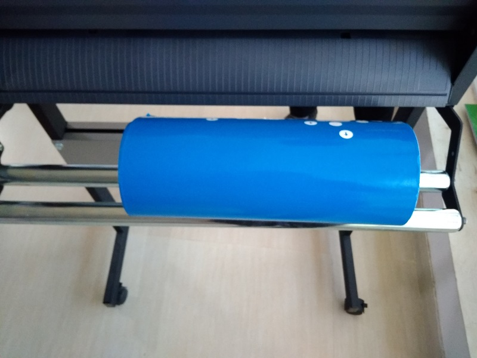
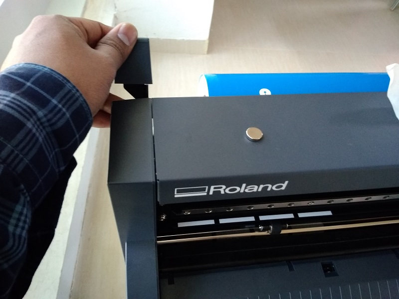
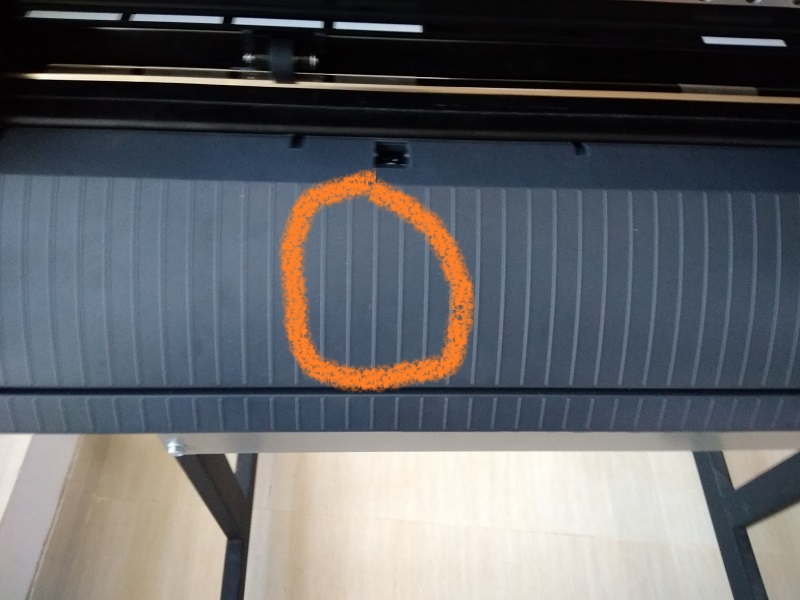

# Allu Chendra Sekhar's fabzero 1st day expirience 
This is Mr.Allu Chendra Sekhar. I am from STPI-PUNE. Working as Tech. Officer.
day 1 on fabzero Pre-Academy
I got oprtunity getting training on FAB LAB Pre-Academy Programme at STPI-Bhubaneswar. On 18th March 2019.
This Pre-Academy training program is launched by Shri.Omkar Rai, DG, STPI.
I met all other colleagues attending for the training. 
My trainers are Mr.Franchi and Mr.Sibu.
Both are explaining well. 
In the afternoon along wit Mr.Franchi and Mr.Sibu we have visited FAB LAB two rooms. 
Mr.Franchie has briefed about the equipments. 

- Roland. 

- EPILOG LASER.
- PUREX.
- 3D WOX Printer.

- Weller heat gun and soldering rod.
- FORMLABS 3D printing device.
- Shopboat wood cutter which runs at 14,000 rpm WEN and DeWALT equipment.

On 19th March 2019 (2nd day)
we have installed softwares 
- Inkscape (2D Drawing)
[click here](https://inkscape.org/release/inkscape-0.92.4/windows/64-bit/exe/dl/)
- Cura (3D drawing)[click here](https://ultimaker.com/en/products/ultimaker-cura-software)
- Git Windows[click here](https://git-scm.com/download/win).

- installed visual Studio Code
- installed Code Spell Checker in visual Studio Code
- Linkage Windows GIT to visual Studio Code:
    1. open New Window in visual Studio Code
    2. Copy the clone Address from github
    3. Control + Shift + P
    4. New address will open then type Git: Clone pate the clone address. 
At 12:45 hrs Mr.Franchie informed will give demo on 3D printer,vily cutting machine.

After lunch mentor give demo of using vily cutting machine like inserting the role into the vily machine and how to take precautions by the time of using roland vily cutting machine.
#### the usage are said bellow:
1. take the role and put it on the vily cutting machine rolling rods
like  
 
2. Then next adjust the roll in white lines using the small rolls 
like  

 

3. then lock the sheet and check it properly adjust are not and check align are adjust properly 
like 
 
 
 
 