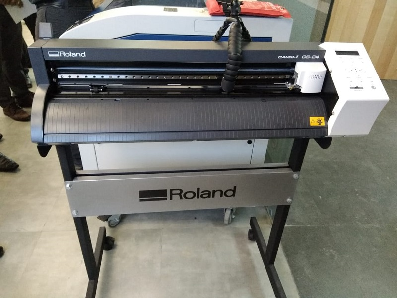
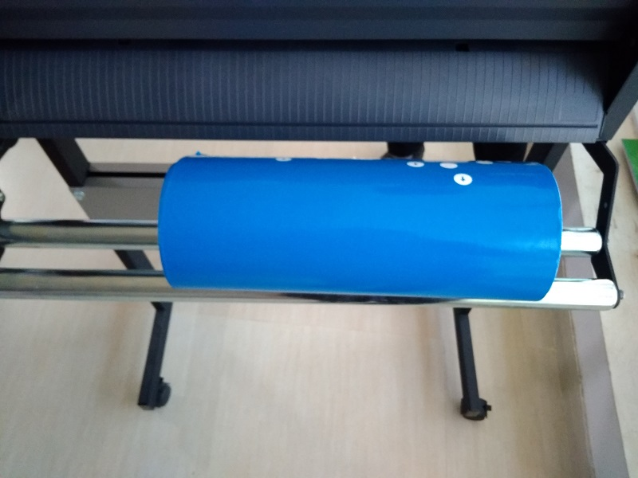
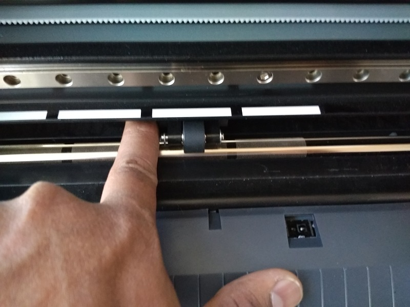
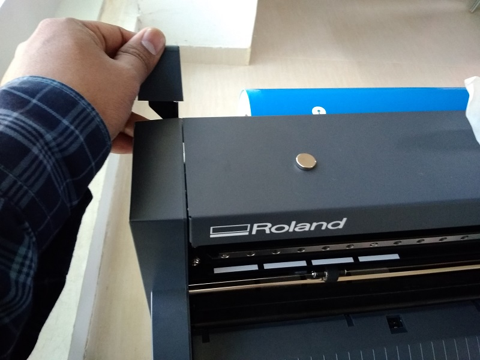
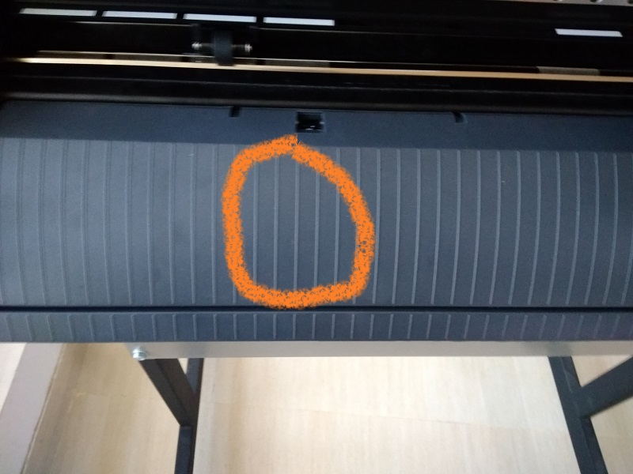
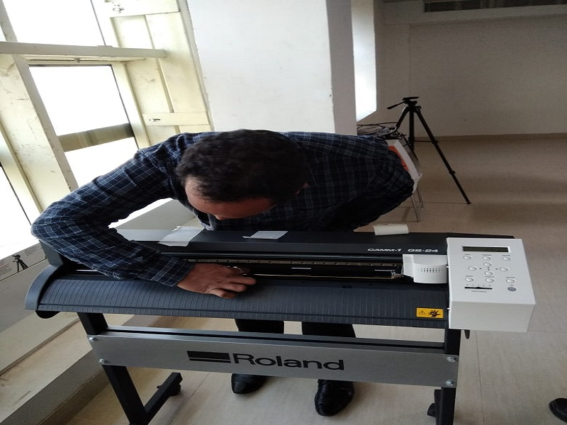
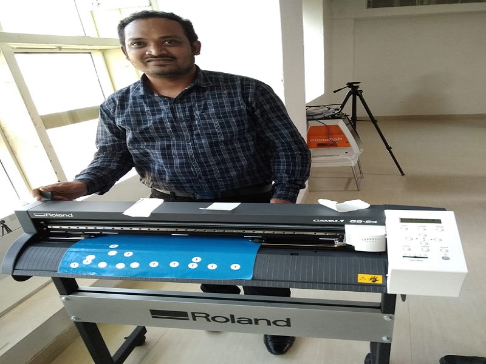

# Roland's vinyl cutter:
### how to use the vinyl cutting machine:
#### To print Sticker into the vinyl roll in vinyl cutting machine:
 1. first we have to use this machine we have create a design in Inkscape 2d design software.  
      * In this software create design and it will save to png format.
      * the it will upload to the "http://fabmodules.org/" site and adjust the force and velocity
      * Next we will give the print the designed png image in vinyl roll
      the information said bellow link  
      [How to design sticker use in vinyl cutter machine](Inkscape_design.md)
   
 2. in first adjust the vinyl roll in this machine as per above said align to use the vertical lines and small rolls.
 3. Then next save file and export to png file. Then give print the png file to the vinyl cutter  
 

using vinyl cutting machine like inserting the role into the vinyl machine and how to take precautions by the time of using roland vinyl cutting machine.
#### the usage are said bellow:
1. take the role and put it on the vinyl cutting machine rolling rods
like   
  
2. Then next adjust the roll in white lines using the small rolls 
like  
  

3. then lock the sheet and check it properly adjust are not and check align are adjust properly 
like  
  
4. check the roll adjust exactly align are not use below vertical lines   
  

  
